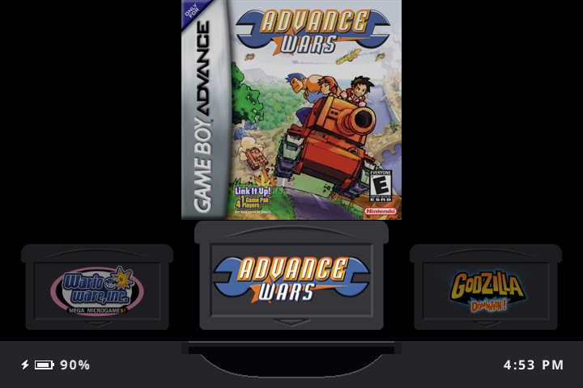
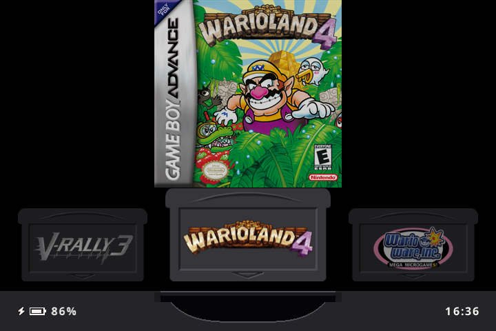
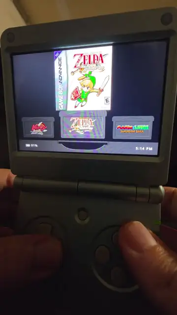
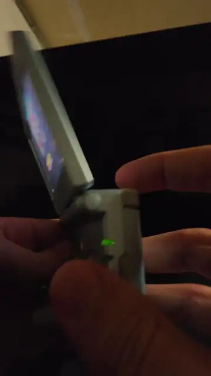
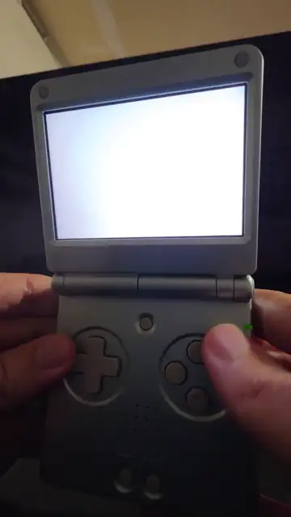

# ezGBA

**No hotkeys. No combos. No menus to get lost in. Simple, simple, simple.**

A fork of [slot.](https://github.com/BrandonKowalski/slot) built for exactly one job: a GBA
handheld for a young kid — pre-reader, unsupervised, first console — can pick up and use with
zero adult explanation required. Every button does one obvious thing, by itself, every time.

Built on the Anbernic RG SP and built for kids or adults wanting a simple seamless GBA experience.

  
  

## See it in action

| Pick a game, play, eject | Brightness on L2/R2 | Close the lid, pick up where you left off |
|:---:|:---:|:---:|
|  |  |  |
| A starts it. MENU ejects it. That's it. | One press, one step. | Sleep, wake, or fully power off - the game comes back where it was. |

## Why this exists

Every retro-handheld guide out there assumes an adult reader who's comfortable with button
chords, settings menus, and "hold X while pressing Y." That's a reasonable assumption for a
hobbyist building their own device.

slot. already got most of the way there — a minimalist shelf of cartridges, no clutter, no
RetroArch menu to get lost in. ezGBA pushes the rest of the way: every remaining button does
exactly one obvious thing, on contact, with no combination required to discover it.

## What's different from upstream

- **No hotkeys, anywhere.** If a button does something, it does that thing by itself.
- **L2/R2 are brightness, not rewind.** Upstream fires rewind/fast-forward on contact with
  no hold threshold at all — genuinely easy for a small hand to trigger by accident mid-game.
  Here they're dead to the emulator (matching real GBA hardware, which never had them) and
  instead dim/brighten the screen, one press, one step.
- **MENU ejects instantly.** One tap saves the game and pops the cart back onto the shelf.
  Upstream needs MENU held for about a second, and a shorter press does nothing - which a
  kid reads as "it's broken."
- **The background shows the selected game**, not a random wallpaper. Scroll to Pokémon,
  see Pokémon's own box art fill the screen behind the shelf. Recognizing a game by its
  picture matters a lot when you can't read its title yet.
- **Per-device theming.** Each kid's console can carry its own accent color for the
  backdrop's tint, via `System/theme.txt`.
- **12-hour clock.** The shelf shows `4:39 PM`, not `16:39`.

Everything else — the lid-close auto-save, the wireless trading, the cartridge-shell shelf —
is upstream's work, unchanged. This fork exists for the handful of things that needed to be
different for a young kid specifically, not to replace what already worked.

## Setup

Follow upstream's own install guide at [slot.kowalski.io](https://slot.kowalski.io) — the
base setup (AGS-102, card layout, adding ROMs) is unchanged. Grab this fork's
[releases](../../releases) instead of upstream's if you want these changes; everything else
about the process is identical.

## AI disclosure

Built with Claude's help, on top of a frontend upstream also built with Claude's help. Every
change was reviewed and tested on real hardware before going near an actual kid's device.

## Credit

All of the actual hard work — the shelf, the rendering, the whole feel of the thing — is
[BrandonKowalski/slot](https://github.com/BrandonKowalski/slot). This fork is a small,
opinionated layer on top for one particular use case.
